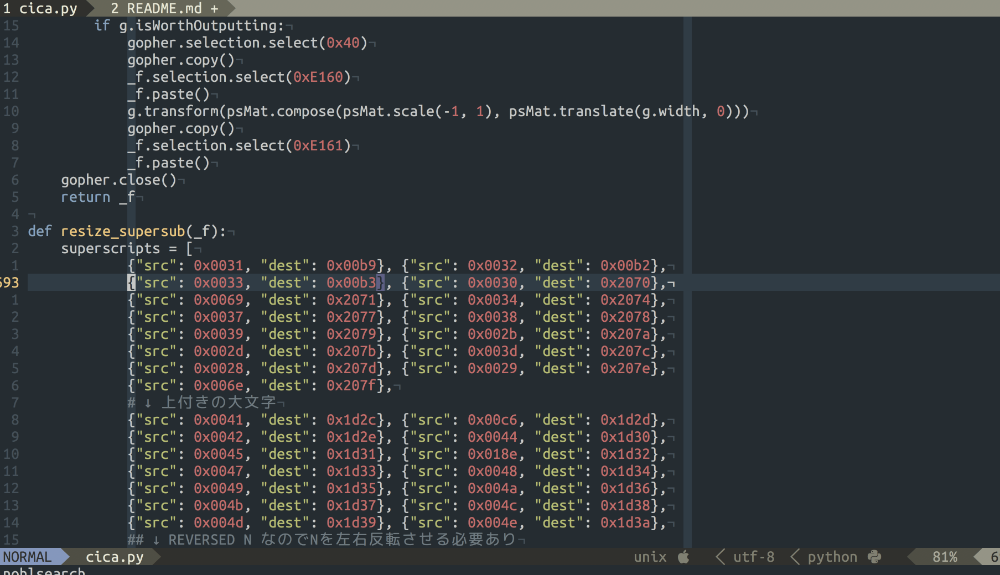
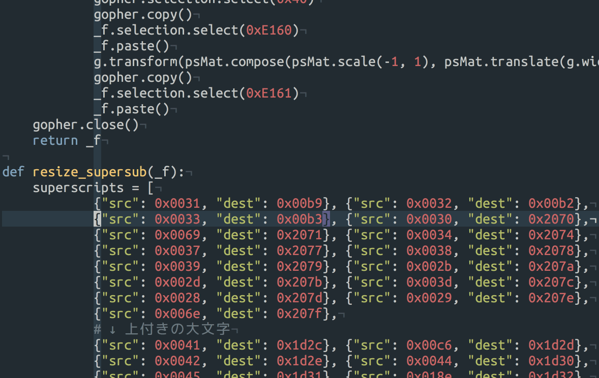
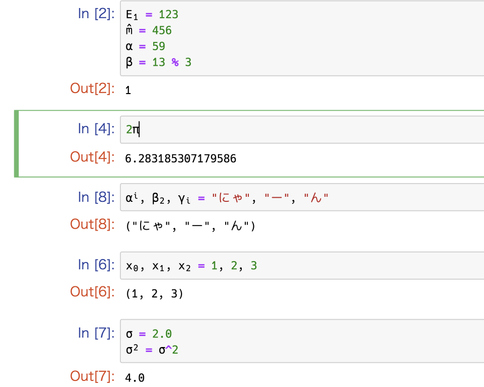
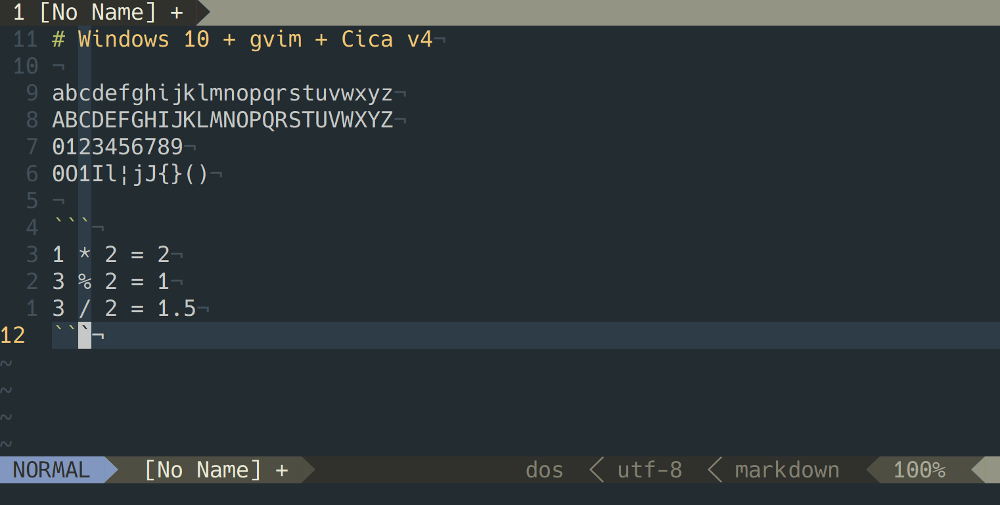

# プログラミング用日本語等幅フォント Cica

## [ダウンロード](https://github.com/miiton/Cica/releases/latest)

|                                                                     |                                                                        |
| :----:                                                              | :----:                                                                 |
| **MacVim + NERDTree + CtrlP + LightLine**                           | **Cica v3との違い**                                                    |
| [](screenshots/macvim.png)         | [](screenshots/cicachange.gif) |
| **Julia Ready**                                                     | **GVim on Windows**                                                    |
| [](screenshots/julia.png) | [](screenshots/gvim.png)       |


## 特徴

* 以下のフォントを合成後に調整した、プログラミング向けの等幅日本語フォントです
    - 英数字、記号類に [Hack](https://sourcefoundry.org/hack/) + [DejaVu Sans Mono](https://dejavu-fonts.github.io/)
    - それ以外の文字に [Rounded Mgen+](http://jikasei.me/font/rounded-mgenplus/)
    - [Nerd Fonts](https://github.com/ryanoasis/nerd-fonts) (= Powerlineパッチ、その他適用済。Pomiconsは除外※)
    - [Noto Emoji](https://www.google.com/get/noto/)
    - [Icons for Devs](https://github.com/mirmat/iconsfordevs)
    - RictyジェネレータからForkした各種調整
    - 独自の調整として `m` の真ん中の棒を短く（ `rn` と `m` を区別しやすく＆ちょっと可愛らしく）
* tmuxの画面分割に対応しています
* 非HiDPI（非Retina）のWindowsでも文字が欠けません
* 下付き文字や上付き文字など、特殊な文字の判読性を考慮（[JuliaLang](https://julialang.org/) を想定しています）
* ライセンス
    - フォントファイルは SIL Open Font License 1.1 です
    - 合成スクリプト等のソースコードは MIT です

```
o Cica
|\
* * Icons for Devs
|\
* * NERDFonts (without Pomicons※)
|\
* * Noto Emoji (無しバージョンあり)
|\
* * DejaVu Sans Mono
|\
* * Hack
 \
  * Rounded Mgen+
  |\
  | * 源の角ゴシック
  |
  * Rounded M+
  |
  * M+ OUTLINE FONTS
```

- ※Nerd Fontsに含まれるPomiconsのグリフは商用利用が出来ないライセンスなのでジェネレータからは除外しています。
- ※アイコン類はフォントをインストール後 [https:\/\/miiton.github.io\/Cica\/](https://miiton.github.io/Cica/) で確認出来ます。

## Q&A

### 矢印記号、半角なの...？  

ソースコード中で矢印記号はそう使わないと判断して半角幅にしました。
とはいえMarkdown中では使うこともあると思うのですが、その場合
あいまい文字が半角の環境で見切れてしまうので、それであれば
多少不格好でも判読できたほうが良いという判断です。

尚、絵文字の矢印を使うという手もあります（`U+F060 - U+F063 `）

### NerdTree、CtrlPでVueのアイコンが出ない

Vueのアイコンを追加しました（v4.1.0）

.vimrcで以下を追加すると表示できます。（要 [ryanoasis/vim\-devicons: Adds file type glyphs/icons to popular Vim plugins: NERDTree, vim\-airline, Powerline, Unite, vim\-startify and more](https://github.com/ryanoasis/vim-devicons)）

```vim
let g:WebDevIconsUnicodeDecorateFileNodesExtensionSymbols = {}
let g:WebDevIconsUnicodeDecorateFileNodesExtensionSymbols['vue'] = ''
" アイコン入力方法 : `[Ctrl+V]` > `[u]` > `e905`
let g:NERDTreeExtensionHighlightColor = {}
let g:NERDTreeExtensionHighlightColor['vue'] = '42B983'
```


## 既知の問題

* [Ubuntu 上の gVim で powerline 用フォントが少しずれます。 · Issue \#33 · miiton/Cica](https://github.com/miiton/Cica/issues/33)

## ビルド手順

### Dockerを使う場合

※Regular以外のttfファイルがおかしくなる現象が発生しています #39

```sh
git clone https://github.com/miiton/Cica.git
cd Cica
docker-compose build ; docker-compose run --rm cica  # ./dist/ に出力される
```

### 手動でやる場合

2018-08-27時点、Ubuntu 16.04 にて

```sh
sudo apt-get update
sudo apt-get -y install apt-file
sudo apt-file update
sudo apt-file search add-apt-repository
sudo apt-get -y install software-properties-common
sudo apt-get -y install fontforge unar
git clone git@github.com:miiton/Cica.git
cd Cica
curl -L https://github.com/source-foundry/Hack/releases/download/v3.003/Hack-v3.003-ttf.zip -o hack.zip
unar hack.zip
cp ttf/* sourceFonts/
rm hack.zip
rm -r ttf
curl -LO https://osdn.jp/downloads/users/8/8598/rounded-mgenplus-20150602.7z
unar rounded-mgenplus-20150602.7z
cp rounded-mgenplus-20150602/rounded-mgenplus-1m-regular.ttf ./sourceFonts
cp rounded-mgenplus-20150602/rounded-mgenplus-1m-bold.ttf ./sourceFonts
curl -L https://github.com/googlei18n/noto-emoji/raw/master/fonts/NotoEmoji-Regular.ttf -o sourceFonts/NotoEmoji-Regular.ttf
curl -LO http://sourceforge.net/projects/dejavu/files/dejavu/2.37/dejavu-fonts-ttf-2.37.zip
unar dejavu-fonts-ttf-2.37.zip
mv dejavu-fonts-ttf-2.37/ttf/DejaVuSansMono.ttf ./sourceFonts/
mv dejavu-fonts-ttf-2.37/ttf/DejaVuSansMono-Bold.ttf ./sourceFonts/
curl -L https://github.com/mirmat/iconsfordevs/raw/master/fonts/iconsfordevs.ttf -o sourceFonts/iconsfordevs.ttf
fontforge -lang=py -script cica.py
```

[fontforge のバージョンが古いと正常に動作しません #6](https://github.com/miiton/Cica/issues/6)

```
% fontforge --version

Copyright (c) 2000-2012 by George Williams.
 Executable based on sources from 14:57 GMT 31-Jul-2012-ML.
 Library based on sources from 14:57 GMT 31-Jul-2012.
fontforge 20120731
libfontforge 20120731-ML
```

## ライセンス

* [LICENSE.txt](LICENSE.txt)

## 謝辞

Cicaフォントの合成にあたり素晴らしいフォントを提供してくださっている製作者の方々に感謝いたします。

- Hack : [Hack \| A typeface designed for source code](https://sourcefoundry.org/hack/)
- Rounded Mgen+ : [自家製フォント工房](http://jikasei.me/)
- M+ OUTLINE FONTS : [M\+ FONTS](https://mplus-fonts.osdn.jp/)
- Rounded M+ : [自家製フォント工房](http://jikasei.me/)
- 源の角ゴシック : [adobe\-fonts/source\-han\-sans: Source Han Sans \| 思源黑体 \| 思源黑體 \| 源ノ角ゴシック \| 본고딕](https://github.com/adobe-fonts/source-han-sans)
- Noto Emoji : [googlei18n/noto\-emoji: Noto Emoji fonts](https://github.com/googlei18n/noto-emoji)
- NERDFonts (without Pomicons) : [Nerd Fonts \- Iconic font aggregator, collection, and patcher](https://nerdfonts.com/)
- DejaVu Sans Mono : [DejaVu Fonts](https://dejavu-fonts.github.io/)
- Icons for Devs : [mirmat/iconsfordevs: Icons for Devs \- An iconic font made for developers](https://github.com/mirmat/iconsfordevs)
