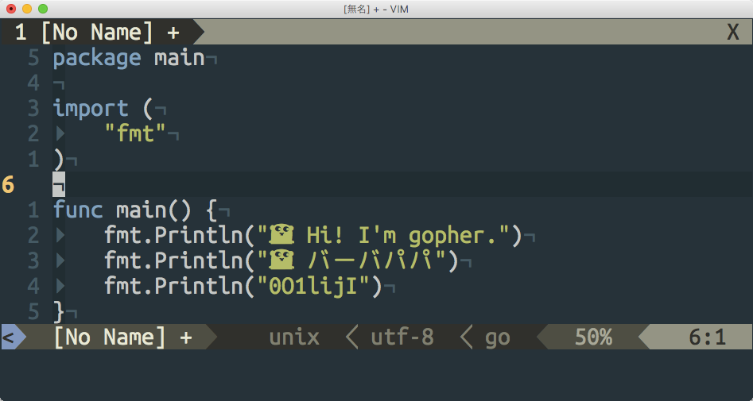

# プログラミング用日本語等幅フォント Cica



## ダウンロード

[リリースページ](https://github.com/miiton/Cica/releases/latest)にビルド済みのフォントを配置しています。

## 概要

プログラミング用の等幅フォントです。
[Ubuntu Mono](http://font.ubuntu.com/) と
[Rounded Mgen+](http://jikasei.me/font/rounded-mgenplus/) を合成して少し調整しています。
[Noto Emoji](https://www.google.com/get/noto/) と
[NERDFonts](https://github.com/ryanoasis/nerd-fonts) を追加合成しています。

```
o Cica
|\
* * NERDFonts (without Pomicons)
|\
* * Noto Emoji
|\
* * Ubuntu Mono
 \
  * Rounded Mgen+
  |\
  | * 源の角ゴシック
  |
  * Rounded M+
  |
  * M+ OUTLINE FONTS
```

## 簡単な特徴

- 英数字に Ubutnu Mono を使用しています
- それ以外の文字に Rounded Mgen+ ゴシック を使用しています
- [Nerd Fonts](https://github.com/ryanoasis/nerd-fonts) を追加合成しています。(= Powerlineパッチ、その他適用済)
- [Noto Emoji](https://www.google.com/get/noto/) を追加合成しています。
- 非HiDPI（非Retina）のWindowsでも文字が欠けません


## バリエーション

| ファイル名             | 説明     |
| ----                   | ----     |
| Cica-Regular.ttf       | 通常     |
| Cica-RegularItalic.ttf | 斜体     |
| Cica-Bold.ttf          | 太字     |
| Cica-BoldItalic.ttf    | 太字斜体 |

※アイコン類はフォントをインストール後 [https:\/\/miiton.github.io\/Cica\/](https://miiton.github.io/Cica/) で確認出来ます。

## ビルド手順

2017-10-08時点、Ubuntu 16.04 にて

```sh
sudo apt-get -y install fontforge unar
git clone git@github.com:miiton/Cica.git
wget http://font.ubuntu.com/download/ubuntu-font-family-0.83.zip
unar ubuntu-font-family-0.83.zip
cp ubuntu-font-family-0.83/UbuntuMono-R.ttf ./sourceFonts/
cp ubuntu-font-family-0.83/UbuntuMono-B.ttf ./sourceFonts/
wget https://osdn.jp/downloads/users/8/8598/rounded-mgenplus-20150602.7z
unar rounded-mgenplus-20150602.7z
cp rounded-mgenplus-20150602/rounded-mgenplus-1m-regular.ttf ./sourceFonts
cp rounded-mgenplus-20150602/rounded-mgenplus-1m-bold.ttf ./sourceFonts
wget https://github.com/googlei18n/noto-emoji/raw/master/fonts/NotoEmoji-Regular.ttf -O sourceFonts/NotoEmoji-Regular.ttf
fontforge -lang=py -script cica.py
```

[fontforge のバージョンが古いと正常に動作しません #6](https://github.com/miiton/Cica/issues/6)

```
% fontforge --version

Copyright (c) 2000-2012 by George Williams.
 Executable based on sources from 14:57 GMT 31-Jul-2012-ML.
 Library based on sources from 14:57 GMT 31-Jul-2012.
fontforge 20120731
libfontforge 20120731-ML
```


# ライセンス

* [LICENSE.txt](LICENSE.txt)

# 謝辞

Cicaフォントの合成にあたり素晴らしいフォントを提供してくださっている製作者の方々に感謝いたします。

- M+ OUTLINE FONTS : [M\+ FONTS](https://mplus-fonts.osdn.jp/)
- Rounded M+ : [自家製フォント工房](http://jikasei.me/)
- 源の角ゴシック : [adobe\-fonts/source\-han\-sans: Source Han Sans \| 思源黑体 \| 思源黑體 \| 源ノ角ゴシック \| 본고딕](https://github.com/adobe-fonts/source-han-sans)
- Rounded Mgen+ : [自家製フォント工房](http://jikasei.me/)
- Ubuntu Mono : [Ubuntu Font Family](http://font.ubuntu.com/)
- Noto Emoji : [googlei18n/noto\-emoji: Noto Emoji fonts](https://github.com/googlei18n/noto-emoji)
- NERDFonts (without Pomicons) : [Nerd Fonts \- Iconic font aggregator, collection, and patcher](https://nerdfonts.com/)

